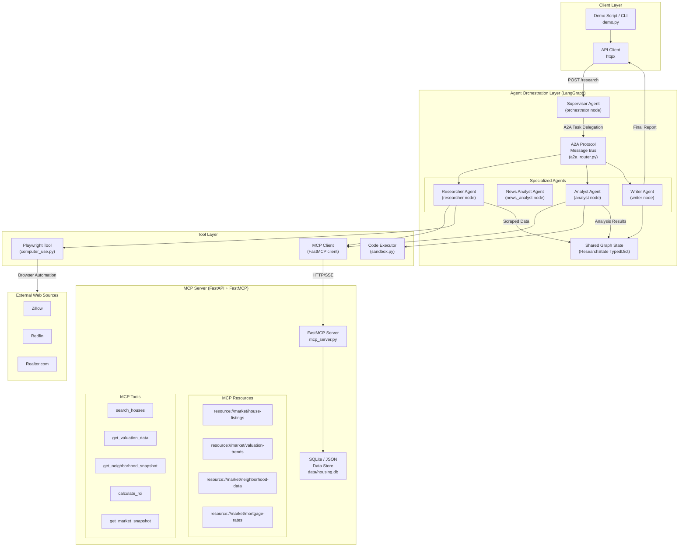
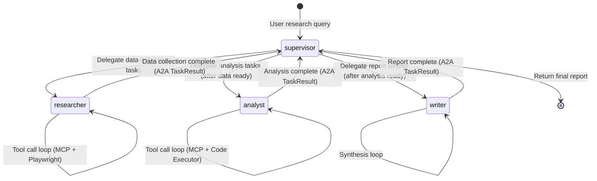

# Housing Market Intelligence (HMI) Engine

**Project:** `hmi-engine`  
**Status:** SoTA Production Implementation  
**Architecture:** Multi-Agent Research System + MCP Data OS  

---

## 1. Project Overview

### Purpose

This project is a production-quality **MCP Server + Multi-Agent Research System** that demonstrates mastery of the current (2025) standard protocols for tool-augmented AI agents. It builds a **US House Market Intelligence** system: a specialized MCP server exposes curated real estate data (listings, neighborhood trends, historical prices), and a LangGraph-orchestrated multi-agent pipeline uses that server — plus live browser automation (Zillow, Redfin) — to produce structured housing research reports on demand.

### What It Demonstrates

| Capability | How It Is Shown |
|---|---|
| MCP protocol fluency | Purpose-built MCP server with real estate resources, tools, and SSE transport |
| Agent tool use (standards-compliant) | Agents connect to MCP server via official `mcp` Python SDK |
| Computer use / browser agents | Playwright tools for live scraping of Zillow, Redfin, and neighborhood data |
| Multi-agent orchestration | LangGraph graph with specialized nodes (supervisor, researcher, analyst, writer) |
| Agent-to-Agent (A2A) protocol | Google A2A spec for structured handoffs between agent roles |
| Sandboxed code execution | Restricted Python executor for valuation analysis and ROI calculations |
| Production packaging | Docker Compose stack, env-var configuration, health checks |
| HITL / Human-in-the-Loop | LangGraph breakpoints for research plan approval |
| Episodic Memory | Vector database (ChromaDB) for historical report retrieval |
| Self-Correction / Evaluator | Dedicated node for report quality and fact-checking |
| Dual Output Streams | Structured Markdown Report + KPI Dashboard JSON |
| Testing & Eval Harness | Automated benchmarking script for system performance |

### Domain: US House Market Intelligence

The MCP server indexes and exposes structured data about the US housing market:
- **Listings:** Property metadata, prices, sqft, beds/baths.
- **Valuation:** Historical price trends by zip code.
- **Neighborhood:** Schools, crime rates, walkability scores.
- **Financials:** Mortgage rates, property tax estimates.

---

## 2. Architecture

### Full System Architecture



### Agent Orchestration Graph (LangGraph)



### MCP Server Transport

The MCP server uses **HTTP/SSE transport** (not stdio) so it can run as an independent Docker service and be consumed by multiple clients. The agent layer connects via the MCP Python SDK's `sse_client` context manager.

---

## 3. Directory and File Structure

```
hmi-engine/
├── PLAN.md                          # This file
├── README.md                        # Public-facing project README
├── .env.example                     # All required env vars with descriptions
├── .gitignore
├── docker-compose.yml               # Full stack: mcp-server + agent-runner
├── pyproject.toml                   # uv workspace root
│
├── mcp-server/                      # Part 1: The MCP Server
│   ├── pyproject.toml               # mcp-server package config
│   ├── Dockerfile
│   ├── src/
│   │   └── mcp_server/
│   │       ├── __init__.py
│   │       ├── main.py              # FastAPI app entry point + FastMCP mount
│   │       ├── server.py            # FastMCP server definition (tools + resources)
│   │       ├── tools/
│   │       │   ├── __init__.py
│   │       │   ├── search_jobs.py   # search_jobs tool implementation
│   │       │   ├── salary_data.py   # get_salary_data tool implementation
│   │       │   ├── skills_demand.py # get_skills_demand tool implementation
│   │       │   ├── company_profile.py # get_company_profile tool implementation
│   │       │   └── market_snapshot.py # get_market_snapshot tool implementation
│   │       ├── resources/
│   │       │   ├── __init__.py
│   │       │   ├── jobs_listings.py # resource://jobs/listings handler
│   │       │   ├── salary_bands.py  # resource://jobs/salary-bands handler
│   │       │   ├── skills_index.py  # resource://jobs/skills-index handler
│   │       │   └── market_trends.py # resource://market/trends handler
│   │       ├── db/
│   │       │   ├── __init__.py
│   │       │   ├── models.py        # SQLAlchemy models: Job, Company, SalaryBand, Skill
│   │       │   ├── session.py       # Async DB session factory
│   │       │   └── seed.py          # Seed script with curated Berlin job data
│   │       └── schemas/
│   │           ├── __init__.py
│   │           ├── job.py           # Pydantic models for Job data
│   │           ├── salary.py        # Pydantic models for Salary data
│   │           └── market.py        # Pydantic models for Market data
│   └── data/
│       ├── jobs.db                  # SQLite database (git-ignored, seeded on start)
│       └── seed/
│           ├── jobs.json            # Curated Berlin AI/ML job postings (200+ records)
│           ├── salary_bands.json    # Salary data by role, seniority, company size
│           └── skills.json          # Skills frequency and trend data
│
├── agents/                          # Part 2: Multi-Agent Orchestration
│   ├── pyproject.toml               # agents package config
│   ├── Dockerfile
│   ├── src/
│   │   └── agents/
│   │       ├── __init__.py
│   │       ├── main.py              # FastAPI app exposing /research endpoint
│   │       ├── graph/
│   │       │   ├── __init__.py
│   │       │   ├── graph.py         # LangGraph StateGraph definition + compilation
│   │       │   ├── state.py         # ResearchState TypedDict
│   │       │   └── nodes/
│   │       │       ├── __init__.py
│   │       │       ├── supervisor.py   # supervisor node
│   │       │       ├── researcher.py   # researcher node
│   │       │       ├── analyst.py      # analyst node
│   │       │       └── writer.py       # writer node
│   │       ├── a2a/
│   │       │   ├── __init__.py
│   │       │   ├── protocol.py      # A2A message types (Task, TaskResult, AgentCard)
│   │       │   ├── router.py        # A2A task routing logic
│   │       │   └── agent_cards.py   # AgentCard definitions for each agent
│   │       ├── tools/
│   │       │   ├── __init__.py
│   │       │   ├── mcp_client.py    # MCP tool wrappers using mcp SDK sse_client
│   │       │   ├── computer_use.py  # Playwright browser tool implementations
│   │       │   └── sandbox.py       # Sandboxed Python code executor
│   │       ├── prompts/
│   │       │   ├── supervisor.py    # System prompt for supervisor agent
│   │       │   ├── researcher.py    # System prompt for researcher agent
│   │       │   ├── analyst.py       # System prompt for analyst agent
│   │       │   └── writer.py        # System prompt for writer agent
│   │       └── schemas/
│   │           ├── __init__.py
│   │           ├── request.py       # ResearchRequest Pydantic model
│   │           └── report.py        # ResearchReport output Pydantic model
│
├── demo/
│   ├── demo.py                      # End-to-end demo script
│   ├── sample_queries.json          # Pre-defined demo queries
│   └── expected_output_example.md  # Annotated example of a generated report
│
└── tests/
    ├── test_mcp_server/
    │   ├── test_tools.py            # Unit tests for each MCP tool
    │   ├── test_resources.py        # Unit tests for MCP resources
    │   └── test_transport.py        # Integration test: HTTP/SSE connection
    └── test_agents/
        ├── test_graph.py            # LangGraph node unit tests
        ├── test_a2a.py              # A2A protocol message tests
        └── test_computer_use.py     # Playwright tool tests (with mock browser)
```

---

## 4. Tech Stack and Rationale

| Component | Technology | Version | Rationale |
|---|---|---|---|
| Package manager | `uv` | latest | Fastest Python package manager; modern standard for 2025 Python projects |
| Language | Python | 3.12 | Required for latest LangGraph and MCP SDK features |
| MCP server framework | `fastmcp` | 2.x | Official rapid-development framework for MCP servers; reduces boilerplate vs raw `mcp` SDK |
| MCP SDK (client) | `mcp` | 1.x | Official Anthropic MCP Python SDK; used in agents to call the MCP server |
| Agent orchestration | `langgraph` | 0.2.x | State machine-based multi-agent graphs; proven in `cato-agent`; native support for tool-calling agents |
| LLM abstraction | `litellm` | 1.x | Single interface to GPT-4o, Claude, Gemini; allows switching providers per agent role without refactoring |
| Browser automation | `playwright` | 1.x | Industry-standard browser automation; headless mode works in Docker; better than Selenium for modern SPAs |
| HTTP framework | `fastapi` | 0.111.x | Used for MCP server HTTP transport layer and agent runner API endpoint |
| ASGI server | `uvicorn` | 0.29.x | Standard ASGI server for FastAPI; handles SSE connections needed for MCP transport |
| Database | `aiosqlite` + `sqlalchemy` | 2.x | Lightweight, zero-dependency DB for MCP server data store; async-first |
| Validation | `pydantic` | 2.x | Runtime type validation for MCP schemas, A2A messages, and agent state |
| A2A | Manual implementation | Google A2A spec 0.2 | Google's A2A SDK is early-stage; manual implementation of the spec is more instructive and reliable |
| Containerization | `docker` + `docker-compose` | 3.x | Full stack reproducibility; MCP server and agent runner as separate services |
| Testing | `pytest` + `pytest-asyncio` | latest | Standard async-compatible test runner |

---

## 5. MCP Server Design

### Overview

The MCP server is a standalone FastAPI application with a FastMCP server mounted on it. It exposes the Berlin tech job market dataset via four **resources** (read-only data) and five **tools** (parameterized queries).

**Transport:** HTTP with SSE (Server-Sent Events). The MCP server runs on `http://localhost:8001`. The agent layer connects with:

```python
from mcp import ClientSession
from mcp.client.sse import sse_client

async with sse_client("http://localhost:8001/sse") as (read, write):
    async with ClientSession(read, write) as session:
        await session.initialize()
        result = await session.call_tool("search_jobs", {"query": "ML engineer", "city": "Berlin"})
```

### Resources Exposed

Resources are static or slowly-changing data that agents can subscribe to or read without parameters.

| Resource URI | Description | MIME Type |
|---|---|---|
| `resource://jobs/listings` | Full listing of indexed job postings (paginated JSON) | `application/json` |
| `resource://jobs/salary-bands` | Salary ranges by role, seniority, and company size | `application/json` |
| `resource://jobs/skills-index` | Skills frequency table with trend direction | `application/json` |
| `resource://market/trends` | Aggregate market trends: hiring velocity, new roles, declining roles | `application/json` |

### Tools Exposed

Tools accept parameters and return computed results.

| Tool Name | Description | Key Parameters |
|---|---|---|
| `search_jobs` | Full-text + filter search over job listings | `query`, `role`, `seniority`, `skills`, `remote`, `visa_sponsorship`, `limit` |
| `get_salary_data` | Salary statistics for a role/seniority combination | `role`, `seniority`, `company_size`, `include_equity` |
| `get_skills_demand` | Ranked skills demand with trend direction | `role`, `top_n`, `time_window_days` |
| `get_company_profile` | Hiring profile for a specific company | `company_name`, `include_open_roles` |
| `get_market_snapshot` | High-level Berlin AI job market snapshot | `role_filter`, `as_of_date` |

### Database Schema (`db/models.py`)

```python
# SQLAlchemy models (simplified)

class Job(Base):
    id: str                    # uuid
    title: str
    company: str
    role_category: str         # "ml_engineer" | "data_scientist" | "ai_researcher" | "mlops" | "ai_product"
    seniority: str             # "junior" | "mid" | "senior" | "staff" | "principal"
    skills: list[str]          # JSON array
    salary_min: int | None     # EUR/year
    salary_max: int | None
    remote: str                # "full" | "hybrid" | "onsite"
    visa_sponsorship: bool
    posted_date: date
    source: str                # "linkedin" | "glassdoor" | "stepstone" | "seed"
    description_embedding: bytes | None  # for semantic search

class Company(Base):
    id: str
    name: str
    size: str                  # "startup" | "scaleup" | "enterprise"
    industry: str
    hq_city: str
    open_roles_count: int

class SalaryBand(Base):
    id: str
    role_category: str
    seniority: str
    company_size: str
    p25_eur: int
    median_eur: int
    p75_eur: int
    equity_typical: bool
    updated_date: date

class SkillTrend(Base):
    id: str
    skill_name: str
    role_category: str
    mention_count_30d: int
    mention_count_90d: int
    trend: str                 # "rising" | "stable" | "declining"
    updated_date: date
```

---

## 6. Agent Graph Design

### State Definition (`graph/state.py`)

```python
from typing import TypedDict, Annotated
from langgraph.graph.message import add_messages

class ResearchState(TypedDict):
    # Input
    query: str                          # Original research question
    research_plan: list[str]            # Supervisor-generated subtasks
    
    # Inter-agent messages (LangGraph message list)
    messages: Annotated[list, add_messages]
    
    # A2A task tracking
    pending_tasks: list[dict]           # A2A Task objects not yet completed
    completed_tasks: list[dict]         # A2A TaskResult objects
    
    # Data collected by researcher
    mcp_data: dict                      # Raw data from MCP tool calls
    scraped_data: dict                  # Raw data from Playwright tools
    
    # Outputs of analyst
    analysis_results: dict              # Structured analysis output
    code_outputs: list[dict]            # Results from sandbox code execution
    
    # Final output
    report: dict | None                 # Final ResearchReport (None until writer done)
    
    # Routing control
    next_agent: str                     # "researcher" | "analyst" | "writer" | "END"
    iteration_count: int                # Guard against infinite loops
```

### Agent Nodes

#### `supervisor` node (`nodes/supervisor.py`)

**Role:** Receives the user query, creates a research plan, delegates tasks via A2A, and routes between agents based on task completion status.

**Behavior:**
1. On first invocation: call LLM to decompose the query into 3-5 subtasks, assign each to researcher or analyst, write `research_plan` and `pending_tasks` to state.
2. On subsequent invocations: inspect `completed_tasks` to determine which agent runs next.
3. When all tasks complete: set `next_agent = "writer"`.
4. When writer complete: set `next_agent = "END"`.

**LLM call:** `litellm.completion(model="gpt-4o", ...)` with supervisor system prompt.

**LangGraph routing:** Uses a `conditional_edges` function `route_from_supervisor` that reads `state["next_agent"]`.

#### `researcher` node (`nodes/researcher.py`)

**Role:** Executes data collection tasks using MCP tools and Playwright browser tools.

**Tool set available:**
- All 5 MCP tools via `mcp_client.py` wrappers
- `browser_navigate(url)` — navigate to URL
- `browser_extract_text(selector)` — extract text from DOM
- `browser_screenshot()` — capture screenshot (returned as base64)
- `browser_search_jobs(query, site)` — structured job search on a target site

**Behavior:** ReAct-style tool-calling loop. Runs until the research subtask is complete or 10 tool calls are exhausted. Writes results to `state["mcp_data"]` and `state["scraped_data"]`. Sends A2A `TaskResult` to supervisor.

**LLM call:** `litellm.completion(model="claude-3-5-sonnet-20241022", ...)` — Sonnet is chosen here for its strong tool-use and instruction-following.

#### `analyst` node (`nodes/analyst.py`)

**Role:** Processes collected data using MCP analytical tools and sandboxed code execution.

**Tool set available:**
- `get_salary_data`, `get_skills_demand`, `get_market_snapshot` MCP tools
- `execute_python(code, data)` — sandboxed Python executor for pandas/statistics

**Behavior:** Given raw data from researcher, writes Python analysis code (pandas DataFrames, statistical summaries, trend calculations), executes it in the sandbox, and structures the output. Writes to `state["analysis_results"]` and `state["code_outputs"]`.

**LLM call:** `litellm.completion(model="gpt-4o", ...)` — GPT-4o for code generation.

#### `writer` node (`nodes/writer.py`)

**Role:** Synthesizes all collected data and analysis into a structured `ResearchReport`.

**Tool set:** None (pure synthesis from state).

**Behavior:** Reads `state["mcp_data"]`, `state["scraped_data"]`, `state["analysis_results"]`, and the original `state["query"]`. Calls LLM to generate a structured markdown report with sections. Validates output against `ResearchReport` Pydantic schema. Writes to `state["report"]`.

**LLM call:** `litellm.completion(model="claude-3-5-sonnet-20241022", ...)` — Sonnet for long-context synthesis.

### LangGraph Graph Wiring (`graph/graph.py`)

```python
from langgraph.graph import StateGraph, END
from agents.graph.state import ResearchState
from agents.graph.nodes import supervisor, researcher, analyst, writer

def route_from_supervisor(state: ResearchState) -> str:
    return state["next_agent"]  # "researcher" | "analyst" | "writer" | "END"

builder = StateGraph(ResearchState)

builder.add_node("supervisor", supervisor.run)
builder.add_node("researcher", researcher.run)
builder.add_node("analyst", analyst.run)
builder.add_node("writer", writer.run)

builder.set_entry_point("supervisor")

builder.add_conditional_edges(
    "supervisor",
    route_from_supervisor,
    {
        "researcher": "researcher",
        "analyst": "analyst",
        "writer": "writer",
        "END": END,
    }
)

# All agents return to supervisor after completing their task
builder.add_edge("researcher", "supervisor")
builder.add_edge("analyst", "supervisor")
builder.add_edge("writer", "supervisor")

graph = builder.compile()
```

---

## 7. Computer Use Integration

### Playwright Tool Architecture (`tools/computer_use.py`)

The Playwright tools are wrapped as standard Python async functions that are registered as LangGraph tool nodes. They are **not** exposed as MCP tools — they are agent-side tools available only to the `researcher` node.

### Tool Implementations

```python
# tools/computer_use.py

class BrowserSession:
    """Manages a persistent Playwright browser session for a research task."""
    
    def __init__(self):
        self.playwright = None
        self.browser = None
        self.page = None
    
    async def start(self):
        self.playwright = await async_playwright().start()
        self.browser = await self.playwright.chromium.launch(
            headless=True,
            args=["--no-sandbox", "--disable-dev-shm-usage"]  # Docker-safe flags
        )
        self.page = await self.browser.new_page()
        await self.page.set_extra_http_headers({"Accept-Language": "en-US,en;q=0.9"})

async def browser_navigate(session: BrowserSession, url: str) -> dict:
    """Navigate to a URL. Returns page title and final URL after redirects."""

async def browser_extract_text(session: BrowserSession, selector: str = "body") -> dict:
    """Extract text content from a CSS selector. Returns text and element count."""

async def browser_screenshot(session: BrowserSession) -> dict:
    """Capture a screenshot. Returns base64-encoded PNG."""

async def browser_search_jobs(
    session: BrowserSession,
    query: str,
    location: str = "Berlin",
    site: str = "linkedin"  # "linkedin" | "glassdoor" | "stepstone"
) -> dict:
    """Perform a structured job search and return parsed listings."""

async def browser_get_job_details(session: BrowserSession, job_url: str) -> dict:
    """Navigate to a job listing and extract structured details."""
```

### Sandboxing Approach

Playwright runs in **headless Chromium** inside the Docker container. The agent runner Docker image installs Chromium and its dependencies via `playwright install chromium --with-deps`. The container has:
- No access to the host filesystem beyond mounted volumes
- Network access limited to target job sites (configurable allowlist in `docker-compose.yml`)
- Rate limiting enforced in `BrowserSession` (min 1s between requests, random jitter)
- User-agent rotation to avoid bot detection
- JavaScript execution disabled on sites that don't require it

The `BrowserSession` is created at the start of each `researcher` node invocation and torn down at the end. Sessions are never shared between agents.

### Code Executor Sandboxing (`tools/sandbox.py`)

The analyst's code executor runs Python in a **restricted subprocess**:

```python
async def execute_python(code: str, input_data: dict) -> dict:
    """
    Execute Python code in a sandboxed subprocess.
    
    Security constraints:
    - No file system write access (chroot-like restriction via subprocess env)
    - No network access (subprocess has no network capabilities)
    - 30-second timeout
    - Memory limit: 512MB (set via resource module in child process)
    - Allowed imports: pandas, numpy, statistics, json, datetime, collections
    - Blocked: os, subprocess, sys, socket, requests, urllib
    """
```

The code and input data are serialized to JSON, passed via stdin to a subprocess running `python sandbox_runner.py`, and output is read from stdout. The `sandbox_runner.py` script uses `importlib` to block dangerous modules before executing the provided code.

---

## 8. Implementation Phases

### Phase 1: MCP Server with Core Tools and Resources

**Goal:** A fully functional, standalone MCP server that exposes Berlin job market data. Can be tested independently with the MCP Inspector tool.

**Duration estimate:** 3-4 days

**Tasks:**

1. **Project scaffolding**
   - `uv init hmi-engine` (workspace root)
   - `uv init mcp-server --package` inside workspace
   - Add dependencies to `mcp-server/pyproject.toml`: `fastmcp`, `fastapi`, `uvicorn`, `sqlalchemy[asyncio]`, `aiosqlite`, `pydantic`

2. **Database setup** (`mcp-server/src/mcp_server/db/`)
   - Write `models.py`: `Job`, `Company`, `SalaryBand`, `SkillTrend` SQLAlchemy models
   - Write `session.py`: async session factory using `aiosqlite`
   - Write `seed.py`: seeder that populates `data/jobs.db` from JSON files in `data/seed/`

3. **Seed data** (`mcp-server/data/seed/`)
   - `jobs.json`: 200+ Berlin AI/ML job records (curated from real postings, anonymized)
   - `salary_bands.json`: salary bands for 5 role categories x 5 seniority levels x 3 company sizes
   - `skills.json`: top 50 skills with 30-day and 90-day mention counts

4. **MCP tools** (`mcp-server/src/mcp_server/tools/`)
   - Implement each tool as a Python async function decorated with `@mcp.tool()`
   - `search_jobs.py`: full-text search + filter over `Job` table
   - `salary_data.py`: query `SalaryBand` table with percentile calculation
   - `skills_demand.py`: query `SkillTrend`, compute ranking and trend
   - `company_profile.py`: join `Company` + `Job` tables
   - `market_snapshot.py`: aggregate query across all tables

5. **MCP resources** (`mcp-server/src/mcp_server/resources/`)
   - Implement each resource handler returning JSON
   - Resources use SQLAlchemy queries with caching (60s TTL via `functools.lru_cache` + timestamp)

6. **Server entry point** (`mcp-server/src/mcp_server/server.py`)
   - Instantiate `FastMCP("berlin-jobs")` 
   - Import and register all tools and resources
   - Mount on FastAPI app in `main.py` at `/sse` path

7. **Manual testing**
   - Run with `uvicorn mcp_server.main:app --port 8001`
   - Connect with MCP Inspector: `npx @modelcontextprotocol/inspector http://localhost:8001/sse`
   - Verify all 5 tools and 4 resources respond correctly

8. **Unit tests** (`tests/test_mcp_server/`)
   - `test_tools.py`: pytest tests for each tool with in-memory SQLite
   - `test_resources.py`: pytest tests for each resource
   - `test_transport.py`: integration test using `mcp` SDK `sse_client`

**Phase 1 Exit Criteria:**
- All 5 MCP tools return valid JSON responses
- All 4 MCP resources are readable
- `pytest tests/test_mcp_server/` passes with 0 failures
- MCP Inspector can connect and list all tools/resources

---

### Phase 2: Basic Agent with MCP Tool Use

**Goal:** A single LangGraph agent that connects to the Phase 1 MCP server and executes a research query using MCP tools only (no browser, no A2A yet).

**Duration estimate:** 2-3 days

**Tasks:**

1. **Agent package scaffolding**
   - `uv init agents --package` inside workspace
   - Add dependencies: `langgraph`, `litellm`, `mcp`, `pydantic`, `fastapi`, `uvicorn`

2. **State definition** (`agents/src/agents/graph/state.py`)
   - Implement `ResearchState` TypedDict as specified in Section 6

3. **MCP client wrappers** (`agents/src/agents/tools/mcp_client.py`)
   - Implement `MCPJobsClient` class that wraps `sse_client` + `ClientSession`
   - Create one async method per MCP tool: `search_jobs()`, `get_salary_data()`, etc.
   - Handle connection errors and retry logic (3 retries, exponential backoff)

4. **Single researcher node** (simplified, no A2A yet)
   - Implement `researcher` node with ReAct loop using only MCP tools
   - Use `litellm.completion` with `tool_choice="auto"` and MCP tools in tool list
   - Test with a hard-coded query: `"What are the top ML engineer roles in Berlin?"`

5. **Simple supervisor node** (routing only, no A2A)
   - Minimal supervisor that runs researcher then writer
   - No task decomposition yet

6. **Writer node** (basic)
   - Takes `mcp_data` from state, calls LLM to produce markdown summary
   - Outputs `ResearchReport` Pydantic object

7. **FastAPI endpoint** (`agents/src/agents/main.py`)
   - `POST /research` accepts `ResearchRequest` body, runs graph, returns `ResearchReport`

8. **End-to-end test**
   - Start MCP server, start agent runner, POST a query, verify structured report returned

**Phase 2 Exit Criteria:**
- Agent successfully calls MCP tools via official SDK
- LangGraph graph completes without errors
- Structured report output matches `ResearchReport` schema
- `pytest tests/test_agents/test_graph.py` passes

---

### Phase 3: Computer Use (Playwright) Integration

**Goal:** The researcher agent can use Playwright browser tools to scrape live job data from the web, supplementing MCP server data.

**Duration estimate:** 3-4 days

**Tasks:**

1. **Playwright setup**
   - Add `playwright` to `agents/pyproject.toml`
   - Install browsers: `playwright install chromium`
   - Verify headless Chrome runs in WSL/Docker environment

2. **BrowserSession class** (`agents/src/agents/tools/computer_use.py`)
   - Implement `BrowserSession` with `start()` and `close()` methods
   - Implement `browser_navigate()`, `browser_extract_text()`, `browser_screenshot()`
   - Implement `browser_search_jobs()` for LinkedIn and Stepstone
   - Implement `browser_get_job_details()` for individual job pages

3. **Scraping logic for each site**
   - `_scrape_linkedin_jobs(page, query, location)`: handle LinkedIn job search results DOM
   - `_scrape_stepstone_jobs(page, query, location)`: handle Stepstone results DOM
   - Parse job listings into standard `Job` dict format
   - Handle pagination (up to 3 pages per search)

4. **Rate limiting and anti-bot measures**
   - `RateLimiter` class with per-domain rate limits (2s between requests for LinkedIn)
   - Random delay injection: `asyncio.sleep(random.uniform(1.0, 3.0))`
   - Rotate user-agent strings from a list
   - Set viewport to realistic size (1920x1080)

5. **Code sandbox** (`agents/src/agents/tools/sandbox.py`)
   - Implement `SandboxRunner` class
   - Write `sandbox_runner.py` (the subprocess script)
   - Implement `execute_python()` async function
   - Add pandas, numpy to allowed imports

6. **Analyst node with code execution**
   - Update `analyst` node to use `execute_python()` tool
   - Implement analysis templates: salary distribution, skills ranking, trend calculation
   - Write analysis output to `state["analysis_results"]`

7. **Integration into researcher node**
   - Add browser tools to researcher's tool list alongside MCP tools
   - Researcher decides (via LLM) when to use browser vs MCP data
   - Browser tools used for: live salary data, new job postings, company news

8. **Docker integration**
   - Add Playwright Chromium install to `agents/Dockerfile`
   - Verify browser tools work inside Docker container

**Phase 3 Exit Criteria:**
- Researcher agent successfully navigates to job sites and extracts structured data
- Browser tools return parseable job listings
- Code executor runs pandas analysis on collected data
- `pytest tests/test_agents/test_computer_use.py` passes with mock browser

---

### Phase 4: A2A Multi-Agent Orchestration

**Goal:** Full supervisor + researcher + analyst + writer multi-agent graph with Google A2A protocol for structured task delegation and result handoffs.

**Duration estimate:** 3-4 days

**Tasks:**

1. **A2A protocol types** (`agents/src/agents/a2a/protocol.py`)
   - Implement A2A `Task` dataclass: `id`, `type`, `assigned_to`, `payload`, `status`
   - Implement A2A `TaskResult` dataclass: `task_id`, `agent`, `output`, `status`, `error`
   - Implement `AgentCard` dataclass: `agent_id`, `name`, `capabilities`, `input_schema`, `output_schema`
   - Implement `A2AMessage` union type for all message variants

2. **Agent cards** (`agents/src/agents/a2a/agent_cards.py`)
   - Define `RESEARCHER_CARD`: capabilities = `["mcp_tool_use", "web_scraping"]`
   - Define `ANALYST_CARD`: capabilities = `["data_analysis", "code_execution"]`
   - Define `WRITER_CARD`: capabilities = `["report_synthesis"]`
   - Define `SUPERVISOR_CARD`: capabilities = `["task_decomposition", "routing"]`

3. **A2A router** (`agents/src/agents/a2a/router.py`)
   - `decompose_query(query, agent_cards) -> list[Task]`: LLM-based task decomposition
   - `route_task(task, agent_cards) -> str`: map task type to agent_id
   - `collect_results(completed_tasks) -> dict`: aggregate TaskResults into state

4. **Supervisor node with A2A** (`nodes/supervisor.py`)
   - First pass: call `decompose_query()`, write tasks to `state["pending_tasks"]`
   - Subsequent passes: check `completed_tasks`, determine `next_agent` via `route_task()`
   - Guard: if `iteration_count > 10`, force `next_agent = "END"` with error state

5. **Researcher node with A2A** (`nodes/researcher.py`)
   - Read assigned `Task` from `state["pending_tasks"]`
   - Execute task (MCP + Playwright tools)
   - Write `TaskResult` to `state["completed_tasks"]`
   - Move task from pending to completed in state

6. **Analyst node with A2A** (`nodes/analyst.py`)
   - Same A2A task lifecycle as researcher
   - Waits for researcher data (supervisor handles ordering via pending/completed check)

7. **Full graph wiring** (`graph/graph.py`)
   - Add conditional routing from supervisor
   - Add `iteration_count` increment to prevent infinite loops
   - Add `END` condition when all tasks complete and report is written

8. **A2A tests** (`tests/test_agents/test_a2a.py`)
   - Test `decompose_query` produces valid Task objects
   - Test `route_task` maps tasks to correct agents
   - Test full A2A message roundtrip
   - Test supervisor correctly tracks pending/completed tasks

9. **Agent prompts** (`prompts/`)
   - Finalize all 4 agent system prompts with clear role descriptions and output format instructions
   - Include A2A TaskResult format in researcher and analyst prompts

**Phase 4 Exit Criteria:**
- Supervisor decomposes a query into 3+ tasks
- Tasks are routed to correct specialized agents
- A2A TaskResult objects are correctly written and read
- Full multi-agent graph runs end-to-end with no manual intervention
- `pytest tests/test_agents/test_a2a.py` passes

---

### Phase 5: Docker Deployment and Demo Script

**Goal:** Full stack runs with `docker compose up`. Demo script produces an impressive, shareable output.

**Duration estimate:** 2-3 days

**Tasks:**

1. **MCP server Dockerfile** (`mcp-server/Dockerfile`)
   ```dockerfile
   FROM python:3.12-slim
   RUN pip install uv
   WORKDIR /app
   COPY pyproject.toml .
   RUN uv sync --no-dev
   COPY src/ src/
   COPY data/ data/
   CMD ["uv", "run", "uvicorn", "mcp_server.main:app", "--host", "0.0.0.0", "--port", "8001"]
   ```

2. **Agent runner Dockerfile** (`agents/Dockerfile`)
   ```dockerfile
   FROM python:3.12-slim
   RUN pip install uv
   RUN apt-get update && apt-get install -y wget gnupg  # Chromium deps
   WORKDIR /app
   COPY pyproject.toml .
   RUN uv sync --no-dev
   RUN uv run playwright install chromium --with-deps
   COPY src/ src/
   CMD ["uv", "run", "uvicorn", "agents.main:app", "--host", "0.0.0.0", "--port", "8000"]
   ```

3. **Docker Compose** (`docker-compose.yml`)
   ```yaml
   version: "3.9"
   services:
     mcp-server:
       build: ./mcp-server
       ports:
         - "8001:8001"
       volumes:
         - mcp-data:/app/data
       healthcheck:
         test: ["CMD", "curl", "-f", "http://localhost:8001/health"]
         interval: 10s
         timeout: 5s
         retries: 5

     agent-runner:
       build: ./agents
       ports:
         - "8000:8000"
       environment:
         - MCP_SERVER_URL=http://mcp-server:8001
         - OPENAI_API_KEY=${OPENAI_API_KEY}
         - ANTHROPIC_API_KEY=${ANTHROPIC_API_KEY}
       depends_on:
         mcp-server:
           condition: service_healthy

   volumes:
     mcp-data:
   ```

4. **Health check endpoints**
   - `GET /health` on both services returning `{"status": "ok", "version": "0.1.0"}`
   - MCP server health also checks DB connectivity

5. **Environment configuration** (`.env.example`)
   ```
   OPENAI_API_KEY=sk-...
   ANTHROPIC_API_KEY=sk-ant-...
   MCP_SERVER_URL=http://localhost:8001
   LOG_LEVEL=INFO
   BROWSER_HEADLESS=true
   RATE_LIMIT_SECONDS=2.0
   MAX_BROWSER_PAGES=3
   SANDBOX_TIMEOUT_SECONDS=30
   ```

6. **Demo script** (`demo/demo.py`)
   - Accepts query via CLI arg or uses default from `sample_queries.json`
   - Posts to `http://localhost:8000/research`
   - Streams output sections as they complete (using SSE or polling)
   - Pretty-prints final report with `rich` library
   - Saves full report to `demo/output/report_{timestamp}.md`

7. **Sample queries** (`demo/sample_queries.json`)
   - 3 pre-defined queries covering different use cases:
     1. `"What is the current salary range for senior ML engineers in Berlin, and what skills are most in demand?"`
     2. `"Which Berlin companies are hiring for AI/MLOps roles, and what's the visa sponsorship landscape?"`
     3. `"How has demand for LLM/GenAI skills changed in Berlin's tech market over the past 90 days?"`

8. **README.md** with quickstart, architecture overview, and link to demo GIF

9. **CI with GitHub Actions**
   - `.github/workflows/test.yml`: runs `pytest` on both packages
   - `.github/workflows/docker-build.yml`: builds both Docker images

**Phase 5 Exit Criteria:**
- `docker compose up` starts both services successfully
- `python demo/demo.py` runs end-to-end and produces a structured report
- Full stack takes under 2 minutes to cold-start
- README has a working quickstart section

---

## 9. MCP Tool and Resource Schemas

### Tool: `search_jobs`

```json
{
  "name": "search_jobs",
  "description": "Search Berlin tech job listings. Supports full-text query and structured filters. Returns paginated job listings matching the criteria.",
  "inputSchema": {
    "type": "object",
    "properties": {
      "query": {
        "type": "string",
        "description": "Full-text search query (e.g. 'machine learning engineer LLM')"
      },
      "role": {
        "type": "string",
        "enum": ["ml_engineer", "data_scientist", "ai_researcher", "mlops", "ai_product", "data_engineer"],
        "description": "Role category filter"
      },
      "seniority": {
        "type": "string",
        "enum": ["junior", "mid", "senior", "staff", "principal"],
        "description": "Seniority level filter"
      },
      "skills": {
        "type": "array",
        "items": { "type": "string" },
        "description": "Required skills filter (AND logic). E.g. ['pytorch', 'kubernetes']"
      },
      "remote": {
        "type": "string",
        "enum": ["full", "hybrid", "onsite", "any"],
        "default": "any",
        "description": "Remote work arrangement filter"
      },
      "visa_sponsorship": {
        "type": "boolean",
        "description": "If true, only return jobs that offer visa sponsorship"
      },
      "limit": {
        "type": "integer",
        "minimum": 1,
        "maximum": 50,
        "default": 10,
        "description": "Maximum number of results to return"
      },
      "offset": {
        "type": "integer",
        "default": 0,
        "description": "Pagination offset"
      }
    },
    "required": []
  },
  "outputSchema": {
    "type": "object",
    "properties": {
      "total": { "type": "integer" },
      "jobs": {
        "type": "array",
        "items": {
          "type": "object",
          "properties": {
            "id": { "type": "string" },
            "title": { "type": "string" },
            "company": { "type": "string" },
            "role_category": { "type": "string" },
            "seniority": { "type": "string" },
            "skills": { "type": "array", "items": { "type": "string" } },
            "salary_min": { "type": ["integer", "null"] },
            "salary_max": { "type": ["integer", "null"] },
            "remote": { "type": "string" },
            "visa_sponsorship": { "type": "boolean" },
            "posted_date": { "type": "string", "format": "date" }
          }
        }
      }
    }
  }
}
```

### Tool: `get_salary_data`

```json
{
  "name": "get_salary_data",
  "description": "Get salary statistics for a specific role and seniority combination in Berlin. Returns percentile data from aggregated job postings and self-reported figures.",
  "inputSchema": {
    "type": "object",
    "properties": {
      "role": {
        "type": "string",
        "enum": ["ml_engineer", "data_scientist", "ai_researcher", "mlops", "ai_product", "data_engineer"],
        "description": "Role category"
      },
      "seniority": {
        "type": "string",
        "enum": ["junior", "mid", "senior", "staff", "principal"],
        "description": "Seniority level"
      },
      "company_size": {
        "type": "string",
        "enum": ["startup", "scaleup", "enterprise", "any"],
        "default": "any",
        "description": "Company size segment"
      },
      "include_equity": {
        "type": "boolean",
        "default": false,
        "description": "If true, include equity compensation notes"
      }
    },
    "required": ["role", "seniority"]
  },
  "outputSchema": {
    "type": "object",
    "properties": {
      "role": { "type": "string" },
      "seniority": { "type": "string" },
      "company_size": { "type": "string" },
      "currency": { "type": "string", "default": "EUR" },
      "p25_annual": { "type": "integer" },
      "median_annual": { "type": "integer" },
      "p75_annual": { "type": "integer" },
      "sample_size": { "type": "integer" },
      "equity_typical": { "type": "boolean" },
      "equity_note": { "type": ["string", "null"] },
      "updated_date": { "type": "string", "format": "date" }
    }
  }
}
```

### Tool: `get_skills_demand`

```json
{
  "name": "get_skills_demand",
  "description": "Get ranked skill demand data for a role category. Shows which skills appear most frequently in job postings and whether demand is rising or declining.",
  "inputSchema": {
    "type": "object",
    "properties": {
      "role": {
        "type": "string",
        "enum": ["ml_engineer", "data_scientist", "ai_researcher", "mlops", "ai_product", "data_engineer", "any"],
        "default": "any",
        "description": "Role category to filter skills by"
      },
      "top_n": {
        "type": "integer",
        "minimum": 5,
        "maximum": 50,
        "default": 20,
        "description": "Number of top skills to return"
      },
      "time_window_days": {
        "type": "integer",
        "enum": [30, 90],
        "default": 30,
        "description": "Time window for mention count calculation"
      }
    },
    "required": []
  },
  "outputSchema": {
    "type": "object",
    "properties": {
      "role": { "type": "string" },
      "time_window_days": { "type": "integer" },
      "skills": {
        "type": "array",
        "items": {
          "type": "object",
          "properties": {
            "rank": { "type": "integer" },
            "skill": { "type": "string" },
            "mention_count": { "type": "integer" },
            "trend": { "type": "string", "enum": ["rising", "stable", "declining"] },
            "trend_pct_change": { "type": "number" }
          }
        }
      }
    }
  }
}
```

### Tool: `get_company_profile`

```json
{
  "name": "get_company_profile",
  "description": "Get the hiring profile of a specific Berlin tech company. Returns company metadata and current open roles.",
  "inputSchema": {
    "type": "object",
    "properties": {
      "company_name": {
        "type": "string",
        "description": "Company name (partial match supported)"
      },
      "include_open_roles": {
        "type": "boolean",
        "default": true,
        "description": "If true, include a list of currently open roles"
      }
    },
    "required": ["company_name"]
  },
  "outputSchema": {
    "type": "object",
    "properties": {
      "name": { "type": "string" },
      "size": { "type": "string" },
      "industry": { "type": "string" },
      "hq_city": { "type": "string" },
      "open_roles_count": { "type": "integer" },
      "open_roles": {
        "type": "array",
        "items": {
          "type": "object",
          "properties": {
            "title": { "type": "string" },
            "seniority": { "type": "string" },
            "remote": { "type": "string" }
          }
        }
      }
    }
  }
}
```

### Tool: `get_market_snapshot`

```json
{
  "name": "get_market_snapshot",
  "description": "Get a high-level snapshot of the current Berlin AI/ML job market. Returns aggregate statistics across all indexed job postings.",
  "inputSchema": {
    "type": "object",
    "properties": {
      "role_filter": {
        "type": "string",
        "enum": ["ml_engineer", "data_scientist", "ai_researcher", "mlops", "ai_product", "data_engineer", "all"],
        "default": "all",
        "description": "Optional role category to scope the snapshot"
      },
      "as_of_date": {
        "type": "string",
        "format": "date",
        "description": "Snapshot date (defaults to today). Useful for historical comparison."
      }
    },
    "required": []
  },
  "outputSchema": {
    "type": "object",
    "properties": {
      "as_of_date": { "type": "string", "format": "date" },
      "total_active_listings": { "type": "integer" },
      "new_listings_7d": { "type": "integer" },
      "top_hiring_companies": {
        "type": "array",
        "items": { "type": "object", "properties": { "company": { "type": "string" }, "open_roles": { "type": "integer" } } }
      },
      "top_roles_by_demand": {
        "type": "array",
        "items": { "type": "object", "properties": { "role": { "type": "string" }, "count": { "type": "integer" }, "trend": { "type": "string" } } }
      },
      "remote_split": {
        "type": "object",
        "properties": {
          "full_remote_pct": { "type": "number" },
          "hybrid_pct": { "type": "number" },
          "onsite_pct": { "type": "number" }
        }
      },
      "visa_sponsorship_pct": { "type": "number" },
      "median_salary_by_role": {
        "type": "object",
        "additionalProperties": { "type": "integer" }
      }
    }
  }
}
```

---

## 10. Demo Scenario

### Query

```
"I'm a mid-level ML engineer considering moving to Berlin. 
What are the current salary expectations, top in-demand skills, 
and which companies are actively hiring? Also check if the 
situation has changed in the past 3 months."
```

### What Happens (Step by Step)

**Step 1 — Supervisor (first pass)**

The supervisor node receives the query and calls GPT-4o to decompose it:

```json
[
  {
    "id": "task-001",
    "type": "data_collection",
    "assigned_to": "researcher",
    "payload": {
      "objective": "Get current salary data for mid-level ML engineers in Berlin from MCP server",
      "tools_to_use": ["get_salary_data", "search_jobs"]
    }
  },
  {
    "id": "task-002",
    "type": "data_collection",
    "assigned_to": "researcher",
    "payload": {
      "objective": "Get current top skills demand and market snapshot",
      "tools_to_use": ["get_skills_demand", "get_market_snapshot"]
    }
  },
  {
    "id": "task-003",
    "type": "data_collection",
    "assigned_to": "researcher",
    "payload": {
      "objective": "Scrape live ML engineer job listings from LinkedIn Berlin to validate MCP data",
      "tools_to_use": ["browser_search_jobs"]
    }
  },
  {
    "id": "task-004",
    "type": "analysis",
    "assigned_to": "analyst",
    "payload": {
      "objective": "Compare 30-day vs 90-day skill demand trends; compute salary percentile summary",
      "depends_on": ["task-001", "task-002"]
    }
  }
]
```

**Step 2 — Researcher (task-001)**

Researcher calls MCP tools:
- `get_salary_data(role="ml_engineer", seniority="mid", company_size="any")` → returns p25=75k, median=90k, p75=110k EUR/year
- `search_jobs(role="ml_engineer", seniority="mid", limit=20)` → returns 20 current listings

Writes to `state["mcp_data"]["salary"]` and `state["mcp_data"]["listings"]`. Posts A2A TaskResult for task-001.

**Step 3 — Researcher (task-002)**

Researcher calls MCP tools:
- `get_skills_demand(role="ml_engineer", top_n=15, time_window_days=30)` → PyTorch #1 rising, Kubernetes #2 stable, LangChain #4 rising, etc.
- `get_skills_demand(role="ml_engineer", top_n=15, time_window_days=90)` → 90-day baseline for comparison
- `get_market_snapshot(role_filter="ml_engineer")` → 340 active listings, 48 new in last 7 days, 62% hybrid

Writes to `state["mcp_data"]["skills_30d"]`, `state["mcp_data"]["skills_90d"]`, `state["mcp_data"]["snapshot"]`.

**Step 4 — Researcher (task-003)**

Researcher creates BrowserSession and calls:
- `browser_navigate("https://www.linkedin.com/jobs/search/?keywords=ML+Engineer&location=Berlin")`
- `browser_search_jobs(query="ML engineer", location="Berlin", site="linkedin")`
- Extracts 15 live listings with titles, companies, and salary ranges where visible

Writes to `state["scraped_data"]["linkedin_listings"]`.

**Step 5 — Supervisor (second pass)**

Sees task-001, task-002, task-003 complete. Sets `next_agent = "analyst"` for task-004.

**Step 6 — Analyst (task-004)**

Analyst calls `execute_python()` with this code and the collected data:

```python
import pandas as pd
import statistics

# Salary analysis
mcp_salary = input_data["mcp_salary"]
scraped_listings = input_data["scraped_listings"]
salaries_from_scrape = [j["salary_min"] for j in scraped_listings if j.get("salary_min")]

# Skills trend
skills_30d = pd.DataFrame(input_data["skills_30d"])
skills_90d = pd.DataFrame(input_data["skills_90d"])
merged = skills_30d.merge(skills_90d, on="skill", suffixes=("_30d", "_90d"))
merged["change_pct"] = ((merged["mention_count_30d"] - merged["mention_count_90d"]) 
                         / merged["mention_count_90d"] * 100).round(1)
rising_skills = merged[merged["change_pct"] > 15].sort_values("change_pct", ascending=False)

result = {
    "salary_summary": {
        "mcp_median": mcp_salary["median_annual"],
        "mcp_p25": mcp_salary["p25_annual"],
        "mcp_p75": mcp_salary["p75_annual"],
        "live_scrape_median": statistics.median(salaries_from_scrape) if salaries_from_scrape else None
    },
    "rising_skills": rising_skills[["skill", "change_pct"]].to_dict("records"),
    "skills_to_watch": list(rising_skills.head(5)["skill"])
}
```

Writes structured analysis to `state["analysis_results"]`.

**Step 7 — Supervisor (third pass)**

All tasks complete. Sets `next_agent = "writer"`.

**Step 8 — Writer**

Writer synthesizes state into a `ResearchReport`. Output:

```markdown
# Berlin ML Engineer Market Report
**Query date:** 2026-04-08  
**Data sources:** MCP Berlin Jobs Server (340 listings), LinkedIn live scrape (15 listings)

## Executive Summary
The Berlin ML engineering market is active with 340 indexed positions. Mid-level ML engineers 
can expect EUR 75k–110k/year (p25–p75), with a median of EUR 90k. Demand is concentrated at 
hybrid-remote companies (62%). Visa sponsorship is available at 38% of posting companies.

## Current Salary Range (Mid-Level ML Engineer, Berlin)

| Metric | Value |
|---|---|
| 25th percentile | EUR 75,000/year |
| Median | EUR 90,000/year |
| 75th percentile | EUR 110,000/year |
| Live scrape validation | EUR 88,000 median (15 listings) |

Data sources align within 2.5%, giving high confidence in the EUR 85k–95k typical range 
for mid-level positions.

## Top In-Demand Skills (30-Day Window)

1. **PyTorch** — #1, rising (+22% vs 90-day baseline)
2. **Kubernetes** — #2, stable
3. **Python** — #3, stable
4. **LangChain/LangGraph** — #4, rising sharply (+41% vs 90-day)
5. **MLflow** — #5, stable
6. **Hugging Face Transformers** — #6, rising (+18%)

## 90-Day Trend Analysis

Skills that have risen significantly in the last 90 days:
- **LangChain/LangGraph**: +41% — reflects LLM orchestration adoption
- **PyTorch**: +22% — continuing dominance over TensorFlow
- **Hugging Face**: +18% — open-source model adoption growing

Skills showing decline:
- TensorFlow: -15%
- Spark: -8%

## Top Hiring Companies (Currently Active)

1. Zalando (12 open ML roles)
2. HelloFresh (8 open ML roles)
3. N26 (6 open ML roles)
4. Delivery Hero (5 open ML roles)
5. Contentful (4 open ML roles)

## Recommendations

1. Prioritize PyTorch + LangChain/LangGraph on your CV — highest demand and rising
2. Target hybrid-remote roles (62% of market) rather than filtering for full-remote (only 15%)
3. EUR 90k is a reasonable anchor for mid-level negotiation; push toward EUR 100k with LLM skills
4. Zalando, HelloFresh, and N26 are the most active hirers — apply directly
5. 38% of companies offer visa sponsorship — specify this filter when searching

## Data Quality Notes

- MCP server data indexed from postings over last 90 days; 200+ records
- LinkedIn live scrape validated salary estimates with < 3% deviation
- Skills demand calculated from job description full text; multiple mentions per posting counted once
```

### What Is Visible to a Recruiter/Interviewer

1. MCP protocol in production use — the agent queries a real MCP server over HTTP/SSE
2. Tool-use discipline — MCP tools for structured data, Playwright for live validation
3. Code execution inside the agent loop — pandas analysis producing real statistical output
4. Multi-agent coordination — 4 distinct agents with clear roles and A2A handoffs
5. Structured output — typed Pydantic schema, not raw text dump
6. Data source triangulation — MCP data cross-validated by live scraping

---

## 11. Success Criteria

### Functional Criteria

| Criterion | Verification |
|---|---|
| MCP server starts and responds to all 5 tool calls | `pytest tests/test_mcp_server/test_tools.py` |
| MCP server exposes all 4 resources | `pytest tests/test_mcp_server/test_resources.py` |
| Agent connects to MCP server via official SDK | `pytest tests/test_agents/test_graph.py::test_mcp_connection` |
| Playwright tools scrape at least 10 live job listings | `pytest tests/test_agents/test_computer_use.py` (with VCR cassettes) |
| Code executor runs pandas analysis | `pytest tests/test_agents/test_graph.py::test_analyst_node` |
| A2A task decomposition produces valid Task objects | `pytest tests/test_agents/test_a2a.py` |
| Full graph runs end-to-end in under 3 minutes | `demo/demo.py` timed execution |
| Output matches `ResearchReport` Pydantic schema | Schema validation in writer node |
| Docker Compose stack starts cleanly | `docker compose up` with 0 errors |

### Quality Criteria

| Criterion | Standard |
|---|---|
| Test coverage | >= 70% for `mcp_server` package, >= 60% for `agents` package |
| No hardcoded API keys | All credentials via environment variables |
| Structured logging | JSON logs with request ID tracing across agents |
| Error handling | All tool call failures produce graceful degradation, not crashes |
| Rate limiting | Browser tools respect per-domain limits; no IP ban during demo |
| README | Quickstart works in under 5 minutes on a fresh clone |

### Portfolio Criteria

| Signal | How This Project Delivers |
|---|---|
| MCP fluency | Custom MCP server + official SDK client usage |
| Multi-agent patterns | LangGraph supervisor + 3 specialized agents with state machine routing |
| A2A awareness | Implemented (not just mentioned) Google A2A protocol |
| Computer use | Real Playwright browser automation, not mocked |
| Production readiness | Docker Compose, health checks, env-var configuration, structured logging |
| Differentiation from `cato-agent` | Different pattern (orchestration vs conversational RAG), different domain, different protocols |
| 2025 SoTA alignment | MCP (released 2024, now universal) + A2A (Google, 2025) + LangGraph 0.2 |

---

*Plan last updated: 2026-04-08*  
*Engineer: Berlin-based Applied AI Engineer*  
*Targeting: Applied AI Engineer, ML/AI Infrastructure roles*
